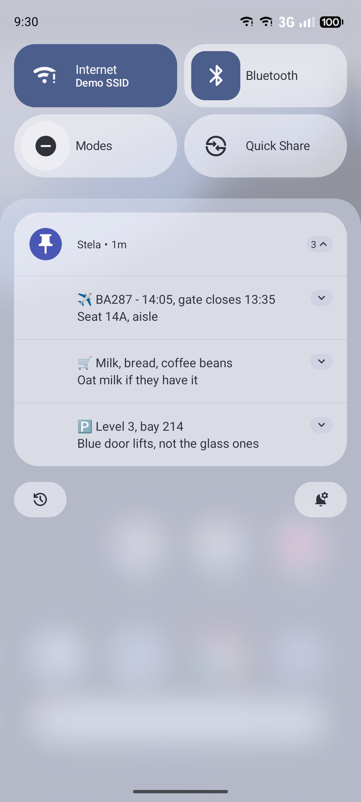
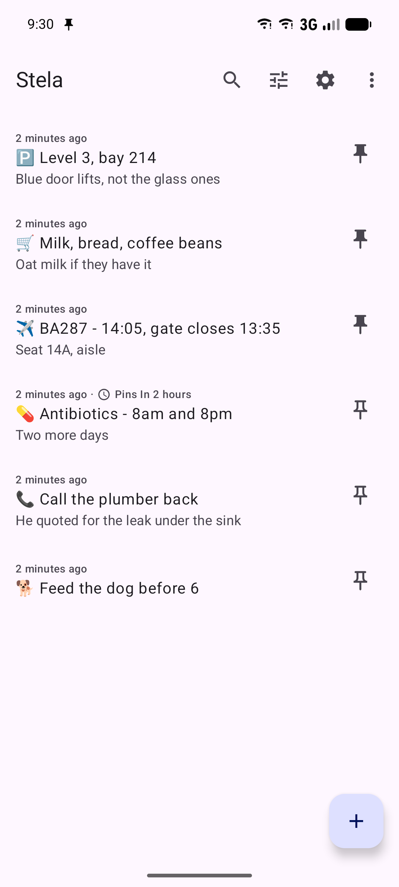
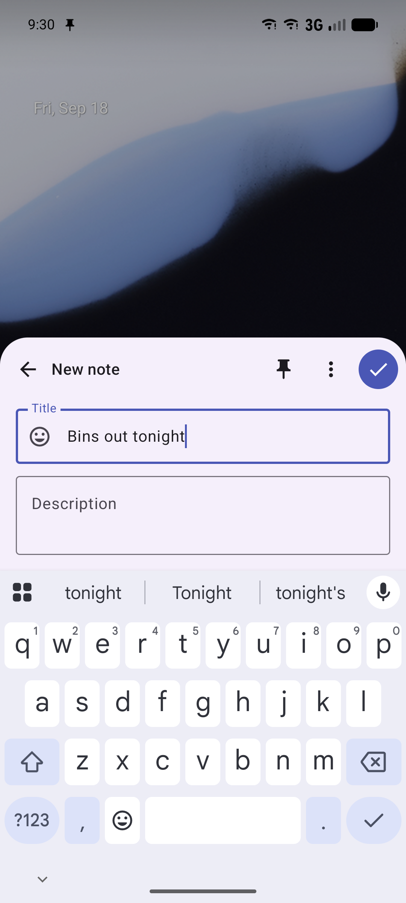

# Stela — Notes as Notifications

[](https://github.com/DavidF-Dev/StelaApp/releases/latest)
[](LICENSE)
[](https://github.com/DavidF-Dev/StelaApp/actions/workflows/build.yml)
<br />
[](#install)
[](#install)

Stela is a simple, **fully offline** Android note-taking app. Write plain notes and
**pin** them as persistent notifications in your status bar, so the things you need to
remember stay in front of you.

No ads. No analytics. **No internet permission** — your notes never leave your device.

<p align="center">
  
  
  
</p>

## Features

- **Notes as notifications** — pin any note as an ongoing status-bar notification, so what
  matters stays in front of you.
- **Persistent by design** — pinned notes self-heal if swiped away, survive reboots and app
  updates, and resist background kill.
- **Capture from anywhere** — a quick-add notification, a home-screen widget, launcher
  shortcuts, and a Quick Settings tile each open a lightweight popup to jot a note fast.
- **Scheduled pins & snooze** — pin a note at a chosen time, auto-unpin later, or snooze a
  pinned note to bring it back when you need it.
- **Archive** — set notes aside without deleting them, then restore or remove them later.
- **Organise** — search, sort, and filter your notes, and give each a per-note emoji.
- **Backup** — export and import your notes as a JSON file, fully offline.
- **Theming** — Light, Dark, or Follow System.

## Install

Stela runs on **Android 8.0 (API 26) or newer**.

| Channel | Status |
| --- | --- |
| [GitHub Releases](https://github.com/DavidF-Dev/StelaApp/releases/latest) | **Available now** — signed APK |
| Google Play | Coming soon |
| F-Droid | Planned |

### From GitHub Releases

1. Download `stela-<version>.apk` (for example `stela-1.8.1.apk`) from the
   [latest release](https://github.com/DavidF-Dev/StelaApp/releases/latest).
2. Open it on your device. Android will ask you to allow installs from whichever app you
   downloaded it with — grant it under *Settings → Apps → Special app access → Install unknown apps*.
3. Allow notifications when Stela asks. Pinned notes **are** notifications, so the app does
   nothing useful without that permission.

Releases are signed with the project key, so a newer APK installs straight over an older one
without losing your notes.

## Honest persistence

Modern Android cannot guarantee truly undismissable notifications or unkillable
processes. Stela's honest promise: pinned notes **self-heal** (re-post if cleared),
**survive reboot**, and **resist background kill**. The onboarding flow helps you grant
the battery-optimisation and autostart exemptions that make this reliable on aggressive
OEM builds.

## Building

Requires JDK 17 (Android Studio's bundled JDK works). From the repo root:

```
./gradlew assembleDebug              # debug APK
./gradlew testDebugUnitTest          # JVM unit tests
./gradlew connectedDebugAndroidTest  # instrumented tests (needs a device/emulator)
./gradlew assembleRelease            # release APK (see Signing)
```

### Signing a release

Release builds are signed from a git-ignored `keystore.properties`. Copy
`keystore.properties.template` to `keystore.properties` and fill it in; generate the
keystore with:

```
keytool -genkeypair -v -keystore stela-release.jks -alias stela \
  -keyalg RSA -keysize 2048 -validity 10000
```

Without `keystore.properties`, `assembleRelease` falls back to debug signing so the build
stays runnable for testing. Never commit the keystore or its passwords.

## License

Stela is free software licensed under the **GNU General Public License v3.0**. See
[LICENSE](LICENSE).

App id: `dev.davidfdev.stela`
